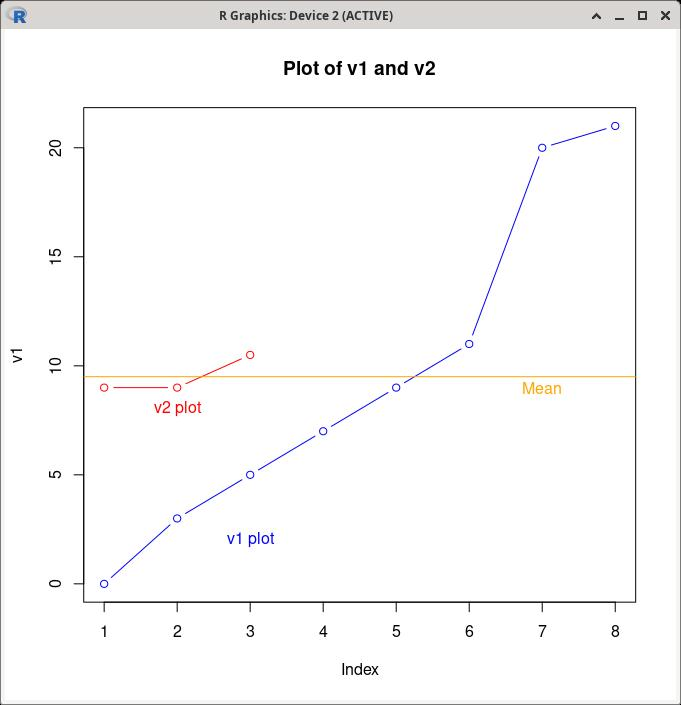

Statistics Terms
################

Statistics in Practice
======================

* There exists **true mean** or mu (:math:`\mu`) for a population.

  * ...but we don't know it.  It is a **parameter**.

* So, we collect data about the population and calculate...

  * ...a **statistic** called the **sample mean** or :math:`\bar{x}`

* We make an inference from :math:`\bar{x}`

Central Limit Theorem
=====================

* As your sample size tends toward infinity, your sample begins to look like the population.

Summary Stats
=============

Centrality
----------

Mean
  Usually what we mean when we say "average."

Median
  The middle value.

Mode
  The most common value.

.. code-block:: R
   :linenos:
   :caption: Summary stats for a vector called v1

   v1 <- c(3,5,7,5,5,9,200)
   summary(v1)
..

.. code-block:: R
   :linenos:
   :caption: The summary output

   > summary(v1)
   Min. 1st Qu.  Median    Mean 3rd Qu.    Max.
   3.00    5.00    5.00   33.43    8.00  200.00
..

+-----------+-----------------------------------------------------------+
| Understanding what we see                                             |
+-----------+-----------------------------------------------------------+
| Field     | Definition                                                |
+===========+===========================================================+
| Min.      | Lowest value in the list                                  |
+-----------+-----------------------------------------------------------+
| 1st Qu.   | First quartile, representing the barrier between those    |
+-----------+-----------------------------------------------------------+
|           | below the bottom 25th percentile and those above it.      |
+-----------+-----------------------------------------------------------+
| Median    | If we line all unique values in order, this is the middle |
+-----------+-----------------------------------------------------------+
|           | one.                                                      |
+-----------+-----------------------------------------------------------+
| 3rd Qu.   | Third quartile, representing the barrier between those    |
+-----------+-----------------------------------------------------------+
|           | below the 75th percentile and those above it.             |
+-----------+-----------------------------------------------------------+
| Max.      | Highest value in the list                                 |
+-----------+-----------------------------------------------------------+

Variability
-----------

Range
^^^^^

    * Plain math:  :math:`range = x_{max} - x_{min}`
    * Purpose:  distance between the top and bottom of your vector or array
    * In R:

.. code-block:: R
    :linenos:

    # Several ways to get the same result
    range(v1)[2] - range(v1)[1]
    max(v2) - min(v2)
..

Variance
^^^^^^^^

    * Plain math:  :math:`\sigma^2 = \frac{\sum_{i=1}^{n}(x_{i} - \bar{x}^2)^2}{n-1}`
    * Purpose:

        * average of the squared distance from the mean for dependent variable
        * shows effects of the independent variable on the dependent variable

    * In R:

.. code-block:: R
    :linenos:

    var(v1)
..

Standard deviation
^^^^^^^^^^^^^^^^^^

    * Plain math:  :math:`\sigma = \sqrt{\frac{\sum_{i=1}^{n}(x_{i} - \bar{x}^2)^2}{n-1}}`
    * Purpose:  measures dispersion of values in a vector
    * In R:  

.. code-block:: R
    :linenos:

    sd(v1)
..

Standard error
^^^^^^^^^^^^^^

    * Plain math:  :math:`\sigma_{\bar{x}} = \frac{\sigma}{\sqrt{n}}`
    * Purpose:  measures spread of values in a vector
    * In R:  

.. code-block:: R
    :linenos:

    sd(v1) / sqrt(length(v1))
..

In practice
-----------

* When we calculate population mean or :math:`mu`, we do not really have enough information to determine what we're looking at!

* `v1` and `v2` have identical means.
* Their standard deviations differ

.. code-block:: R
   :linenos:
   :caption: Summary stats and variability

   # define our two vectors
   v1 <- c(0,3,5,7,9,11,20,21)
   v2 <- c(9,9,10.5)
   # summary stats for each
   summary(v1)
   summary(v2)
   # Variance for each
   var(v1)
   var(v2)
   # Standard deviation for each
   sd(v1)
   sd(v2)
   # Standard error for each
   sd(v1) / sqrt(length(v1))
   sd(v2) / sqrt(length(v2))
   # Our first plot
   plot(v1, type="b", col="blue", main="Plot of v1 and v2")
   text(x=3, y=2, col="blue", 'v1 plot')
   lines(v2, type="b", col="red")
   text(x=2, y=8, col="red", 'v2 plot')
   abline(h = mean(v1), col="orange")
   text(x=7, y=(mean(v1)-0.5), col="orange", 'Mean')
..

..

